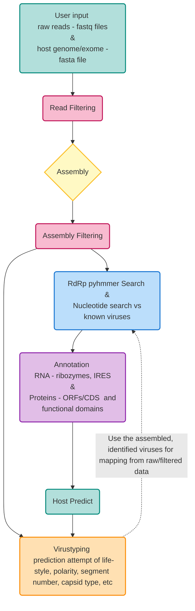

# RolyPoly Documentation

!!! warning "🚧 Experimental"
    RolyPoly is under active development - features may be incomplete or experimental.

RolyPoly is an RNA virus analysis toolkit, including a variety of commands and wrappers for external tools (from raw read processing to genome annotation, and back again). It also includes an "end-2-end" command that employs an entire pipeline.

 Note: host prediction and virustyping are not implemented yet.

<!-- 
## Table of Contents

1. [Installation](installation.md)
2. [FAQ](FAQ.md)
3. [Workflow Description](workflow.md)
4. [Commands](commands/index.md)
5. [Examples](examples.md)
6. [Tips and Tricks](tips_and_tricks.md)
7. [Configuration](configuration.md)
8. [Contribute](contribute.md)
<!-- 9. [Dependencies](dependencies.md) -->
<!-- 9. [About](about.md)
10. [Citation](citation.md)
11. [Resource Usage](resource_usage.md) -->
<!-- 
 --> 
